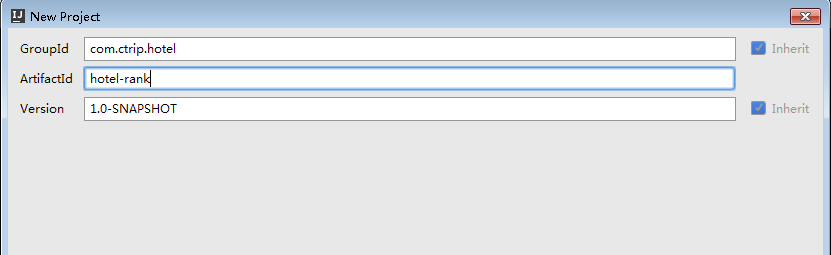
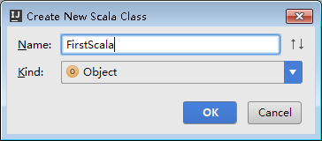

# Spark in action
## 1. 工具下载

<table class="dataintable">
<tr>
<th>工具</th>
<th>版本</th>
<th>下载链接</th>
<th>解压or安装</th>
</tr>
<tr>
    <td>IDE</td>
    <td>Intellij IDEA 2016</td>
    <td><a href="https://cdrive.cloud.ctripcorp.com/apps/files/?dir=%2Fspark">ideaIC-2016.2.3</a></td>
    <td>解压后安装</td>
</tr>
<tr>
    <td>Java</td>
    <td>jdk 1.7</td>
    <td><a href="https://cdrive.cloud.ctripcorp.com/apps/files/?dir=%2Fspark">jdk-7u79-windows-x64</a></td>
    <td>解压后安装</td>
</tr>
<tr>
    <td>Scala</td>
    <td>scala 2.11.8</td>
    <td><a href="https://cdrive.cloud.ctripcorp.com/apps/files/?dir=%2Fspark">scala-2.11.8</a></td>
    <td>解压</td>
</tr>
<tr>
    <td>Hadoop</td>
    <td>hadoop 2.6.0</td>
    <td><a href="https://cdrive.cloud.ctripcorp.com/apps/files/?dir=%2Fspark">hadoop-2.6.0</a></td>
    <td>解压</td>
</tr>
<tr>
    <td>Spark</td>
    <td>spark 2.0.1</td>
    <td><a href="https://cdrive.cloud.ctripcorp.com/apps/files/?dir=%2Fspark">spark-2.0.1-bin-hadoop2.6</a></td>
    <td>解压</td>
</tr>
</table>

    以上工具建议解压到同一个目录下；本次安装过程皆以D:/spark为例，如下图所示
 
## 2. 工具安装
### 2.1. Intellij安装
    双击ideaIC-2016.2.3.exe，点击Next，如下图所示
 

    建议在这一步将安装路径修改，可选择一个剩余空间较多的盘，以下图为例
 

    之后逐一点击Next即可，完成Intellij的安装
### 2.2. Java安装
    双击jdk-7u79-windows-x64.exe，
    建议修改安装路径如下（安装路径在配置Java环境变量的时候需要用到）
    C:\Program Files\Java\jdk1.7.0_79
    之后逐一点击Next即可，完成Java的安装
## 3. 配置环境变量
### 3.1. Java环境变量配置
    打开【计算机】，选择【系统属性】，如下图所示
     

    之后依次选择【高级系统设置】-【环境变量】-【xx的用户变量】，
    选择【新建】，新建用户变量JAVA_HOME，变量名为JAVA_HOME，变量值为Java的安装路径，如下图所示
  

    选择【新建】，新建用户变量CLASSPATH，变量名为CLASSPATH
    变量值如下（copy即可）
    .;%JAVA_HOME%\lib\dt.jar;%JAVA_HOME%\lib\tools.jar;
    如下图所示
 

    选择【新建】，新建用户变量PATH，变量名为PATH，
    变量值如下（copy即可）
    .;%JAVA_HOME%\bin
    如下图所示
 

    至此，Java环境变量配置完成
### 3.2. Spark环境变量配置
    继续，选择【新建】，新建用户变量HADOOP_HOME，
    变量名为HADOOP_HOME，变量值为Hadoop工具保存的路径，如下图所示
 

    选择【新建】，新建用户变量SPARK_HOME，
    变量名为SPARK_HOME，变量值为Spark工具保存的路径，如下图所示
 

    在已经新建的用户变量中选择【Path】，选择【编辑】，
    将Spark工具中的bin目录添加进变量值中，注意不同的变量值之间用英文分号;进行分隔
    然后将Hadoop工具中的bin目录添加进变量值中
    最终，变量名为Path的变量值如下
    .;%JAVA_HOME%\bin;E:\Spark2.0.1\spark-2.0.1-bin-hadoop2.6\bin;E:\Hadoop2.6.0\hadoop-2.6.0\bin;
    
    至此，Spark环境变量配置完成
## 4. 编写代码
### 4.1 编写Scala
#### 4.1.1 安装Scala插件
    打开Intellij，选择【File】-【Settings】-【Plugins】，输入Scala，如下图所示

 
    
    选择【Search in repositories】，找到Scala插件，选择【Install】，如下图所示

 

    至此，Scala插件安装完成
#### 4.1.2 编写Scala前准备
    打开Intellij，选择【File】-【New】-【Project】-【Maven】-【Next】
    GroupId为组织名称
    ArtifactId为jar包名称(之后打jar包时将用到)
    下图为示例
 

    选择【Next】，Project为项目名称，下图为示例，选择【Finish】
 

    选择【File】-【Project Structure】-【Global Libraries】-【+】-【Scala SDK】-【Browse】
    选择Scala工具中的lib目录，如下图所示
 

    选择【Global Libraries】-右键【scala-sdk-2.11.8】-【Copy to Project Libraries】-【OK】-【Apply】
    如下图所示
 
    
    至此，则将scala添加进当前项目，如下图所示
    

    在当前项目中，选择【src】-右键【main】-【New】-【Directory】，输入scala
    如下图所示
 

    选择【src】-【main】-右键【scala】-【Mark Directory as】-【Sources Root】
    如下图所示
 
#### 4.1.3 编写第一个Scala(example)
    在当前项目中，选择【src】-【main】-右键【scala】-【New】-【Scala Class】-下拉选择【Object】
    输入类名FirstScala，如下图所示
 
    
    在当前类中输入测试代码，右键【Run 'FirstScala'】，即可运行Scala
    如下图所示
 
#### 4.1.4 编写第一个Spark(example)
    选择【File】-【Project Structure】-【Libraries】-【+】-【Java】
    选择Spark工具中的jars目录，如下图所示
    【OK】-【Apply】
 

    在当前项目中，选择【src】-【main】-右键【scala】-【New】-【Scala Class】-下拉选择【Object】
    输入类名FirstSpark，
    在当前类中输入测试代码，右键【Run 'FirstScala'】，即可运行local模式下的Spark
    如下图所示
     
